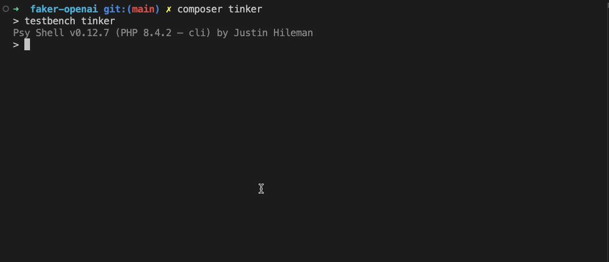

# Laravel Faker OpenAI Provider

<p align="center">
    
</p>

A Laravel package that extends FakerPHP by adding an AI-powered data generator using OpenAI. This allows you to generate more realistic and context-aware fake data in your Laravel applications.

## Installation

Install the package via Composer:

```bash
composer require jpcaparas/laravel-faker-openai
```

The package will automatically register its service provider if you're using Laravel's package auto-discovery.

## Configuration

1. Make sure you have your OpenAI API key set in your `.env` file:

```env
OPENAI_API_KEY=your-api-key-here
```

2. The package uses `gpt-3.5-turbo` model by default.

## Usage

The package adds a new `promptAI()` method to the Faker generator. You can use it in several ways:

### Basic Usage

```php
$faker = app(\Faker\Generator::class);

// Generate a fake name using AI
$name = $faker->promptAI('name');

// Generate a movie review
$review = $faker->promptAI('movieReview');

// Generate a movie description
$description = $faker->promptAI('movieDescription');
```

... you can also use the built-in `fake()` helper:

```php
$name = fake('name');
```

### With Fallback Values

You can provide fallback values that will be used if the AI request fails:

```php
// String fallback
$name = $faker->promptAI('name', 'John Doe');

// Closure fallback
$name = $faker->promptAI('name', fn() => 'John Doe');
```

### Error Handling

By default, errors are logged and the fallback value is returned. You can make it throw exceptions instead:

```php
try {
    $name = $faker->promptAI('name', null, true); // Set throwOnError to true
} catch (\Exception $e) {
    // Handle the error
}
```

## How It Works

The package works by:
1. Intercepting FakerPHP method calls through a prompt
2. Sending them to OpenAI's GPT model
3. Returning AI-generated responses that match FakerPHP's expected output format

## Testing

Run the test suite:

```bash
composer test
```

## License
MIT